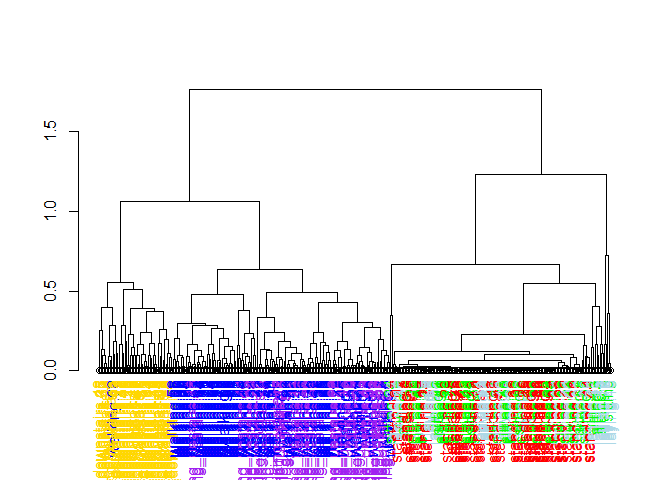

## Data


```r
train_data %>% 
  as_tibble()
```

```
## # A tibble: 7,352 × 563
##    t_body_acc…¹ t_body…² t_bod…³ t_bod…⁴ t_bod…⁵ t_bod…⁶ t_bod…⁷ t_bod…⁸ t_bod…⁹
##           <dbl>    <dbl>   <dbl>   <dbl>   <dbl>   <dbl>   <dbl>   <dbl>   <dbl>
##  1        0.289 -0.0203   -0.133  -0.995  -0.983  -0.914  -0.995  -0.983  -0.924
##  2        0.278 -0.0164   -0.124  -0.998  -0.975  -0.960  -0.999  -0.975  -0.958
##  3        0.280 -0.0195   -0.113  -0.995  -0.967  -0.979  -0.997  -0.964  -0.977
##  4        0.279 -0.0262   -0.123  -0.996  -0.983  -0.991  -0.997  -0.983  -0.989
##  5        0.277 -0.0166   -0.115  -0.998  -0.981  -0.990  -0.998  -0.980  -0.990
##  6        0.277 -0.0101   -0.105  -0.997  -0.990  -0.995  -0.998  -0.990  -0.996
##  7        0.279 -0.0196   -0.110  -0.997  -0.967  -0.983  -0.997  -0.966  -0.983
##  8        0.277 -0.0305   -0.125  -0.997  -0.967  -0.982  -0.996  -0.966  -0.983
##  9        0.277 -0.0218   -0.121  -0.997  -0.961  -0.984  -0.998  -0.957  -0.984
## 10        0.281 -0.00996  -0.106  -0.995  -0.973  -0.986  -0.995  -0.974  -0.986
## # … with 7,342 more rows, 554 more variables: t_body_acc_max_x <dbl>,
## #   t_body_acc_max_y <dbl>, t_body_acc_max_z <dbl>, t_body_acc_min_x <dbl>,
## #   t_body_acc_min_y <dbl>, t_body_acc_min_z <dbl>, t_body_acc_sma <dbl>,
## #   t_body_acc_energy_x <dbl>, t_body_acc_energy_y <dbl>,
## #   t_body_acc_energy_z <dbl>, t_body_acc_iqr_x <dbl>, t_body_acc_iqr_y <dbl>,
## #   t_body_acc_iqr_z <dbl>, t_body_acc_entropy_x <dbl>,
## #   t_body_acc_entropy_y <dbl>, t_body_acc_entropy_z <dbl>, …
## # ℹ Use `print(n = ...)` to see more rows, and `colnames()` to see all variable names
```
561 columns representing different motion measures, along with a column for subject and for activity


```r
train_data %>% 
  count(subject)
```

```
## # A tibble: 21 × 2
##    subject     n
##      <dbl> <int>
##  1       1   347
##  2       3   341
##  3       5   302
##  4       6   325
##  5       7   308
##  6       8   281
##  7      11   316
##  8      14   323
##  9      15   328
## 10      16   366
## # … with 11 more rows
## # ℹ Use `print(n = ...)` to see more rows
```
21 subjects, each with a varying number of observations, totalling 7,352 rows


### Activities


```r
#slide 4/18
train_data %>% 
  count(activity)
```

```
## # A tibble: 6 × 2
##   activity               n
##   <fct>              <int>
## 1 standing            1374
## 2 sitting             1286
## 3 laying              1407
## 4 walking             1226
## 5 walking_downstairs   986
## 6 walking_upstairs    1073
```

One of 6 activities characterize each of the observations in the rows

## Average acceleration for first subject


```r
# plotting average acceleration for first subject ####
#slide 5/18
sub1 <- train_data %>% 
  filter(subject==1)

sub1 %>% 
  select(1, 2, activity) %>% 
  mutate(index=1:nrow(.)) %>% 
  pivot_longer(1:2, names_to="measure", values_to="value") %>% 
  ggplot(aes(index, value, colour = activity)) +
  geom_point() +
  scale_y_continuous(breaks=seq(-.6, 4, .2), labels = ~round(.x, 2)) +
  facet_wrap(~measure)
```

<!-- -->

## Clustering based just on average acceleration (columns 1 - 3)


```r
# clustering based just on average acceleration ####
#slide 6/18
sub1df <- as.data.frame(sub1)
rownames(sub1df) <- make.unique(as.character(sub1df$activity)) #rownames must be unique, add unique number then remove when adding label colours

distance_matrix <- dist(sub1df[1:3])
hclustering <- hclust(distance_matrix)
#plot(hclustering)

colorCodes <- c("standing"="red", "sitting"="green", "laying"="lightblue",
                "walking"="blue", "walking_downstairs"="yellow", "walking_upstairs"="purple" )

## function to set label color
#https://stackoverflow.com/questions/18802519/label-and-color-leaf-dendrogram
labelCol <- function(x) {
  if (is.leaf(x)) {
    ## fetch label
    label <- attr(x, "label")
    code <- str_remove(label, "\\..*$") #remove the unique parts of rownames added by make.unique() above
    ## use the following line to reset the label to one letter code
    # attr(x, "label") <- code
    attr(x, "nodePar") <- list(lab.col=colorCodes[code])
  }
  return(x)
}

## apply labelCol on all nodes of the dendrogram
d <- dendrapply(as.dendrogram(hclustering), labelCol)
plot(d)
```

<!-- -->


Average acceleration metrics (first 3 columns) is able to separate out some of the activities, but not super well

Colour codes:

* red = standing
* green = sitting
* lightblue = laying 
* blue = walking
* yellow = walking downstairs
* purple = walking upstairs

### plotting max acceleration for first subject


```r
sub1 %>% 
  select(10, 11, activity) %>% 
  mutate(index=1:nrow(.)) %>% 
  pivot_longer(1:2, names_to="measure", values_to="value") %>% 
  ggplot(aes(index, value, colour = activity)) +
  geom_point() +
  facet_wrap(~measure, scales="free_y")
```

<!-- -->


## Clustering based just on maximum acceleration (columns 10 - 12)


```r
# clustering based just on maximum acceleration ####
#slide 8/18

distance_matrix <- dist(sub1df[10:12])
hclustering <- hclust(distance_matrix)
#plot(hclustering)

## apply labelCol on all nodes of the dendrogram
d <- dendrapply(as.dendrogram(hclustering), labelCol)
plot(d)
```

<!-- -->
Colour codes:

* red = standing
* green = sitting
* lightblue = laying 
* blue = walking
* yellow = walking downstairs
* purple = walking upstairs

## Singular Value Decomposition


```r
# singular value decomposition ####
#slide 9/18

svd1 <- svd(scale(sub1[-c(562,563)]))

tibble(index=1:nrow(sub1),
       activity=sub1$activity,
       svd_1=svd1$u[,1],
       svd_2=svd1$u[,2]) %>% 
  pivot_longer(contains("svd"), names_to="component", values_to="value") %>% 
  ggplot(aes(index, value, colour=activity)) +
  geom_point() +
  facet_wrap(~component, scales="free_y")
```

<!-- -->

```r
#first component = walking vs standing/sitting/laying (moving vs still)
#second component = standing/walking/walking downstairs vs walking upstairs (moving upward vs not)
#(sitting and laying contribute to both poles but more the first)
```

The matrix U from the SVD is contains 347 rows x 347 columns

* SVD1 = walking vs standing/sitting/laying (moving vs still)
* SVD2 = standing/walking/walking downstairs vs walking upstairs (moving upward vs not)


### find the measure that most highly loads onto SVD1


```r
# find maximum contributor ####
#slide 10/18

plot(svd1$v[,2], pch=19)
```

<!-- -->
The vector V from SVD contains 561 rows and 347 columns. The above is a plot of all 561 rows from the second column, representing the loadings of the 561 measures.

## New clustering with the measure that is the maximum contributor


```r
# new clustering with maximum contributor ####
#slide 11/18

max_contrib <- which.max(svd1$v[, 2]) #which of the 561 features contributes most of the variations across observations

#cluster with accelerations + maximum contributor
distance_matrix <- dist(sub1df[, c(10:12, max_contrib)])
hclustering <- hclust(distance_matrix)
#plot(hclustering)

## apply labelCol on all nodes of the dendrogram
d <- dendrapply(as.dendrogram(hclustering), labelCol)
plot(d)
```

<!-- -->

```r
# colorCodes <- c("standing"="red", "sitting"="green", "laying"="lightblue",
#                 "walking"="blue", "walking_downstairs"="yellow", "walking_upstairs"="purple" )

#now the various activities are separating out more
#3 clear clusters, "walking_upstairs"="purple", "walking"="blue", "walking_downstairs"="yellow"
```

now the various activities are separating out more, with 3 clear clusters, "walking_upstairs"="purple", "walking"="blue", "walking_downstairs"="yellow"


```r
# maximum contributor ####
#slide 12/18 

names(sub1[max_contrib])
```

```
## [1] "f_body_acc_mean_freq_z"
```

```r
#body acceleration mean frequency in z dimension
```

This is the maximum contributor

## K-means clustering (nstart=1, first try)


```r
# K-means clustering (nstart=1, first try) ####
#slide 13/18

#note there's some randomness each time kmeans() is run
#you may get a suboptimal solution by chance if you just use nstart=1
#best to use more nstarts to increase chance of getting more optimal solution

set.seed(2021)
k_clust <- kmeans(sub1[-c(562,563)], centers = 6, nstart=1)
table(k_clust$cluster, sub1$activity)
```

```
##    
##     standing sitting laying walking walking_downstairs walking_upstairs
##   1        0       0      0       0                  0               53
##   2       46      33     24       0                  0                0
##   3        0       2     10       0                  0                0
##   4        7      12     16       0                  0                0
##   5        0       0      0      95                  0                0
##   6        0       0      0       0                 49                0
```

```r
#6 clusters
#cluster 2 is combination of standing sitting and laying
#cluster 1 is walking up
#cluster 6 is walking down
#cluster 5 is walking
```
6 clusters

* cluster 2 is combination of standing sitting and laying
* cluster 1 is walking up
* cluster 6 is walking down
* cluster 5 is walking


### if you try again you'll get a different answer


```r
#slide 14/18
#if you try again you'll get a different answer
set.seed(2022)
k_clust <- kmeans(sub1[-c(562,563)], centers = 6, nstart=1)
table(k_clust$cluster, sub1$activity)
```

```
##    
##     standing sitting laying walking walking_downstairs walking_upstairs
##   1        2      10     18       0                  0                0
##   2        0       0     29       0                  0                0
##   3        0       0      3       0                  0               53
##   4        0       0      0       0                 49                0
##   5       51      37      0       0                  0                0
##   6        0       0      0      95                  0                0
```

```r
#cluster 1 is a combination of standing, sitting and laying
```
cluster 1 is a combination of standing, sitting and laying

## K-means clustering with nstart=100


```r
#slide 15/18
#now try nstart=100
set.seed(2022)
k_clust <- kmeans(sub1[-c(562,563)], centers = 6, nstart=100)
table(k_clust$cluster, sub1$activity)
```

```
##    
##     standing sitting laying walking walking_downstairs walking_upstairs
##   1        2      10     18       0                  0                0
##   2        0       0     29       0                  0                0
##   3        0       0      3       0                  0               53
##   4        0       0      0       0                 49                0
##   5       51      37      0       0                  0                0
##   6        0       0      0      95                  0                0
```

```r
#with 100 starts, the solution looks identical to Roger's 
#takes the most optimal solution of 100 tries
#things separate out a bit better this time
#cluster 2 is laying
#cluster 6 is walking
#cluster 4 is walking down
```
with 100 starts, the solution looks identical to Roger's 
this takes the most optimal solution of 100 tries
things separate out a bit better this time

* cluster 2 is laying
* cluster 6 is walking
* cluster 4 is walking down

### Cluster 2 variable centers (laying)


```r
# Cluster 2 variable centers (laying)
#slide 17/18

#plot the first 10 centers of 561 features for cluster 2
plot(k_clust$center[2, 1:10], pch=19, ylab="Cluster Center", xlab="")
```

<!-- -->

```r
#so the first cluster has high values on the first 3 features (mean body acceleration)
# and low values for features 4 - 10
```


### Cluster 6 variable centers (walking)


```r
# cluster 6 variable centers (walking)
#slide 18/18

#plot the first 10 centers of 561 features for cluster 6
plot(k_clust$center[6, 1:10], pch=19, ylab="Cluster Center", xlab="")
```

<!-- -->

```r
#walking has a different set of cluster centers for first 10 of 561 features compared to laying

#by examining profile of centers, you can get a hint as to which features will
#be most useful for predicting different activities
```
walking has a different set of cluster centers for first 10 of 561 features compared to laying

by examining profile of centers, you can get a hint as to which features will
be most useful for predicting different activities

