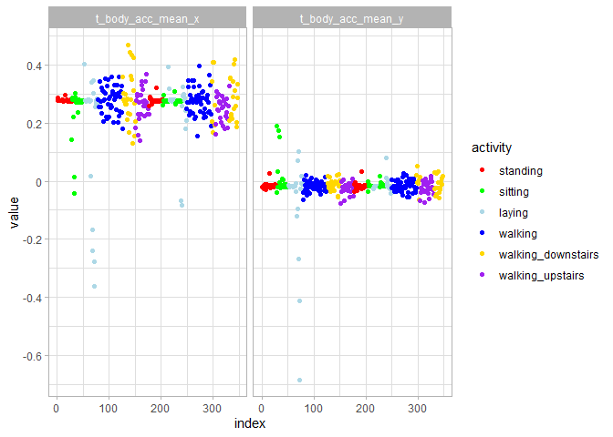
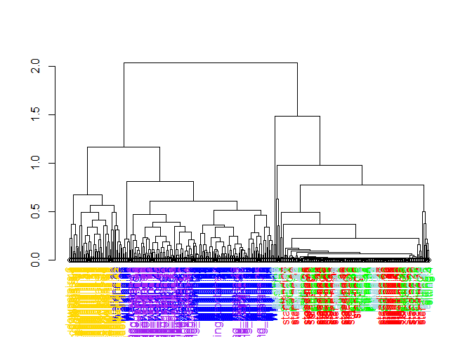
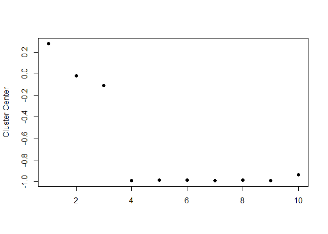

## Data


```r
train_data %>% 
  as_tibble() %>% 
  head()
```

```
## # A tibble: 6 × 563
##   t_body_acc_m…¹ t_bod…² t_bod…³ t_bod…⁴ t_bod…⁵ t_bod…⁶ t_bod…⁷ t_bod…⁸ t_bod…⁹
##            <dbl>   <dbl>   <dbl>   <dbl>   <dbl>   <dbl>   <dbl>   <dbl>   <dbl>
## 1          0.289 -0.0203  -0.133  -0.995  -0.983  -0.914  -0.995  -0.983  -0.924
## 2          0.278 -0.0164  -0.124  -0.998  -0.975  -0.960  -0.999  -0.975  -0.958
## 3          0.280 -0.0195  -0.113  -0.995  -0.967  -0.979  -0.997  -0.964  -0.977
## 4          0.279 -0.0262  -0.123  -0.996  -0.983  -0.991  -0.997  -0.983  -0.989
## 5          0.277 -0.0166  -0.115  -0.998  -0.981  -0.990  -0.998  -0.980  -0.990
## 6          0.277 -0.0101  -0.105  -0.997  -0.990  -0.995  -0.998  -0.990  -0.996
## # … with 554 more variables: t_body_acc_max_x <dbl>, t_body_acc_max_y <dbl>,
## #   t_body_acc_max_z <dbl>, t_body_acc_min_x <dbl>, t_body_acc_min_y <dbl>,
## #   t_body_acc_min_z <dbl>, t_body_acc_sma <dbl>, t_body_acc_energy_x <dbl>,
## #   t_body_acc_energy_y <dbl>, t_body_acc_energy_z <dbl>,
## #   t_body_acc_iqr_x <dbl>, t_body_acc_iqr_y <dbl>, t_body_acc_iqr_z <dbl>,
## #   t_body_acc_entropy_x <dbl>, t_body_acc_entropy_y <dbl>,
## #   t_body_acc_entropy_z <dbl>, t_body_acc_ar_coeff_x_1 <dbl>, …
## # ℹ Use `colnames()` to see all variable names
```
561 columns representing different motion measures, along with a column for subject and for activity


```r
train_data %>% 
  count(subject)
```

```
## # A tibble: 21 × 2
##    subject     n
##      <dbl> <int>
##  1       1   347
##  2       3   341
##  3       5   302
##  4       6   325
##  5       7   308
##  6       8   281
##  7      11   316
##  8      14   323
##  9      15   328
## 10      16   366
## # … with 11 more rows
## # ℹ Use `print(n = ...)` to see more rows
```
21 subjects, each with a varying number of observations, totalling 7,352 rows


### Activities


```r
#slide 4/18
train_data %>% 
  count(activity)
```

```
## # A tibble: 6 × 2
##   activity               n
##   <fct>              <int>
## 1 standing            1374
## 2 sitting             1286
## 3 laying              1407
## 4 walking             1226
## 5 walking_downstairs   986
## 6 walking_upstairs    1073
```

One of 6 activities characterize each of the observations in the rows

## Average acceleration for first subject


```r
# plotting average acceleration for first subject ####
#slide 5/18
sub1 <- train_data %>% 
  filter(subject==1)

colorCodes <- c("standing"="red", "sitting"="green", "laying"="lightblue",
                "walking"="blue", "walking_downstairs"="gold", "walking_upstairs"="purple" )

sub1 %>% 
  select(1, 2, activity) %>% 
  mutate(index=1:nrow(.)) %>% 
  pivot_longer(1:2, names_to="measure", values_to="value") %>% 
  ggplot(aes(index, value, colour = activity)) +
  geom_point() +
  scale_y_continuous(breaks=seq(-.6, 4, .2), labels = ~round(.x, 2)) +
  scale_colour_manual(values=colorCodes) +
  facet_wrap(~measure)
```

<!-- -->

We can see that the first 3 columns/measures, which relate to body mean acceleration, don't do the greatest job of distinguishing the 6 different activities.


## Clustering based just on average acceleration (columns 1 - 3)


```r
# clustering based just on average acceleration ####
#slide 6/18
sub1df <- as.data.frame(sub1) #need to convert to data frame for clustering functions
rownames(sub1df) <- make.unique(as.character(sub1df$activity)) #rownames must be unique for clustering, add unique number then remove when adding label colours

distance_matrix <- dist(sub1df[1:3])
hclustering <- hclust(distance_matrix)
#plot(hclustering)


## function to set label color
#https://stackoverflow.com/questions/18802519/label-and-color-leaf-dendrogram
labelCol <- function(x) {
  if (is.leaf(x)) {
    ## fetch label
    label <- attr(x, "label")
    code <- str_remove(label, "\\..*$") #remove the unique parts of rownames added by make.unique() above
    ## use the following line to reset the label to one letter code
    # attr(x, "label") <- code
    attr(x, "nodePar") <- list(lab.col=colorCodes[code])
  }
  return(x)
}

## apply labelCol on all nodes of the dendrogram
d <- dendrapply(as.dendrogram(hclustering), labelCol)
plot(d)
```

<!-- -->

Colour codes:

* red = standing
* green = sitting
* lightblue = laying 
* blue = walking
* yellow = walking downstairs
* purple = walking upstairs

Hierarchical clustering uses the similarities/differences in terms of the metrics between rows/observations of subject 1  to group together similar rows/observations. 

Average acceleration metrics (the first 3 columns) are not very good measures to use in grouping together the rows in which subject 1 is doing the same activities.


### plotting max acceleration for first subject


```r
sub1 %>% 
  select(10, 11, activity) %>% 
  mutate(index=1:nrow(.)) %>% 
  pivot_longer(1:2, names_to="measure", values_to="value") %>% 
  ggplot(aes(index, value, colour = activity)) +
  geom_point() +
  scale_colour_manual(values=colorCodes) +
  facet_wrap(~measure, scales="free_y")
```

<!-- -->

The measures in columns 10 and 11, body acceleration max x and y, seem to be better at distinguishing certain activities, specifically the walking activities (walking, walking up, walking down) vs the stationary activities (standing, sitting, laying).


## Clustering based just on maximum acceleration (columns 10 - 12)


```r
# clustering based just on maximum acceleration ####
#slide 8/18

distance_matrix <- dist(sub1df[10:12])
hclustering <- hclust(distance_matrix)
#plot(hclustering)

## apply labelCol on all nodes of the dendrogram
d <- dendrapply(as.dendrogram(hclustering), labelCol)
plot(d)
```

<!-- -->

Colour codes:

* red = standing
* green = sitting
* lightblue = laying 
* blue = walking
* yellow = walking downstairs
* purple = walking upstairs

Because columns 10-12 are better at distinguishing activities, similarities/differences based on these measures do a better job of clustering together the similar observations/rows which reflect the same activities.

## Singular Value Decomposition (SVD)

Rather than going through a few columns at a time, which will take a while with 561 total columns, we can use SVD to figure out which are the measures that best explain most of the variance among observations/rows. We can run SVD on all subjects, then just focus on the values for subject 1.


```r
# singular value decomposition ####
#slide 9/18

#svd1 <- svd(scale(sub1[-c(562,563)]))
svd1 <- svd(scale(train_data[-c(562,563)]))

tibble(index=1:nrow(sub1),
       activity=sub1$activity,
       svd_1=svd1$u[1:nrow(sub1),1], #just taking the first 347 rows = subject 1
       svd_2=svd1$u[1:nrow(sub1),2]) %>% 
  pivot_longer(contains("svd"), names_to="component", values_to="value") %>% 
  ggplot(aes(index, value, colour=activity)) +
  geom_point() +
  scale_colour_manual(values = colorCodes) +
  facet_wrap(~component, scales="free_y")
```

<!-- -->

```r
#first component = walking vs standing/sitting/laying (moving vs still)
#second component = standing/walking/walking downstairs vs walking upstairs (moving upward vs not)
#(sitting and laying contribute to both poles but more the first)
```

U, the left singular vectors from the SVD, is a 7,352 x 561 matrix. Each of these 561 columns are like principle components, the first contains the most variance from the data, the second contains the second most variance, etc.

v, the right singular vectors from the SVD, is a 561 x 561 matrix. Each of the 561 columns represents the new singular vectors/principle components from 1 to 561, and each of the 561 rows represents the original variables from the data. The values in the first column indicate the loadings of the original variables onto the first singular vector/PC, the values in the second column indicate the loadings of the original variables onto the second singular vector/PC, etc.   

d from the SVD is a vector of 561 values which are the singular values, related to the square root of eigenvalues. The singular values tell how much variance in the data each of the singular vectors/PCs explain. 
The first 6 are:
1447.125  520.943  340.198  321.342  279.054  266.639
And their proportion to the sum of all singular values are:
0.075 0.027 0.018 0.017 0.014 0.014
So the first singular vector/PC explains 7.5% of the variance in the data, the second explains 2.7% of the variance, etc.

When we plot the first subjects values on the first 2 singular vectors, we can see that they use as much of the variance as possible in the data (while remaining orthogonal/independent of each other) to do the best and second best job at differentiating among the different observations/activities.

* SVD1 = walking vs standing/sitting/laying (moving vs still)
* SVD2 = standing/walking/walking downstairs vs walking upstairs (moving upward vs not)


### find the measure that most highly loads onto SVD1


```r
# find maximum contributor ####
#slide 10/18

#plot(svd1$v[,1], pch=19)

tibble(index=1:ncol(train_data[-c(562,563)]),
       measures=names(train_data[-c(562,563)]),
       svd_rightVector_1=svd1$v[,1]) %>% 
  ggplot(aes(index, svd_rightVector_1)) +
  geom_point() + 
  geom_text(aes(label=index), nudge_x = 12, check_overlap=TRUE)
```

<!-- -->

V from SVD is a 561 x 561 matrix of the loadings of the original 561 variables onto the new 561 singular vectors/PCs. The above is a plot of all 561 rows from the second column, representing the loadings of the 561 measures.

## New clustering with the measure that is the maximum contributor

Now we can determine which is the maximum contributor to singular vector 1 by finding the maximum value/highest loading. This turns out to be original measure 13, which is is the measure t_body_acc_min_x, which seems to be minimum body acceleration in the x direction.


```r
# new clustering with maximum contributor ####
#slide 11/18

(max_contrib <- which.max(svd1$v[, 1])) #which of the 561 features contributes most of the variations across observations
```

```
## [1] 13
```

```r
#13
#names(train_data[-c(562,563)])[max_contrib]
#t_body_acc_min_x

#cluster with accelerations + maximum contributor
distance_matrix <- dist(sub1df[, c(10:12, max_contrib)])
hclustering <- hclust(distance_matrix)
#plot(hclustering)

## apply labelCol on all nodes of the dendrogram
d <- dendrapply(as.dendrogram(hclustering), labelCol)
plot(d)
```

<!-- -->

```r
#now the various activities are separating out more
#3 clear clusters, "walking_upstairs"="purple", "walking"="blue", "walking_downstairs"="yellow"
```

When we use the maximum contributor to the first singular vector in the hierarchical clustering along with original measures 10 to 12, the distances between rows become much easier to separate out and so the various activities are separating out a lot more, with 3 clear clusters, "walking_upstairs"="purple", "walking"="blue", "walking_downstairs"="yellow" all on the left, with the stationary activities all on the right of the dendrogram. 


## K-means clustering (nstart=1, first try)

We can also use K-means clustering as an alternative to hierarchical clustering to determine the similarities/differences between rows/observations and separate them into clusters based on similarity. You have to specify how many clusters to find - since there are 6 activities among the rows/observations, we should try to find 6 clusters. 

We will run this on just subject 1.


```r
# K-means clustering (nstart=1, first try) ####
#slide 13/18

#note there's some randomness each time kmeans() is run
#you may get a suboptimal solution by chance if you just use nstart=1
#best to use more nstarts to increase chance of getting more optimal solution

set.seed(2021)
k_clust <- kmeans(sub1[-c(562,563)], centers = 6, nstart=1)
#str(k_clust$cluster) 
#vector of 347 values indicate which cluster (1 to 6) each row/observation belong to.
table(k_clust$cluster, sub1$activity)
```

```
##    
##     standing sitting laying walking walking_downstairs walking_upstairs
##   1        0       0      0       0                  0               53
##   2       46      33     24       0                  0                0
##   3        0       2     10       0                  0                0
##   4        7      12     16       0                  0                0
##   5        0       0      0      95                  0                0
##   6        0       0      0       0                 49                0
```

Note that there's some randomness in the kmeans() function, so to keep the result the same set the seed. 
The clustering returns a vector of 347 values indicating which of the 6 clusters each row/observation was designated. 

When we tabulate the 6 clusters each row was classified into against the 6 activities each row actually belongs to, we see the above table.

* cluster 2 is combination of standing, sitting, and laying
* cluster 1 is walking up
* cluster 6 is walking down
* cluster 5 is walking


### if you try again you'll get a different answer


```r
#slide 14/18
#if you try again you'll get a different answer
set.seed(2022)
k_clust <- kmeans(sub1[-c(562,563)], centers = 6, nstart=1)
table(k_clust$cluster, sub1$activity)
```

```
##    
##     standing sitting laying walking walking_downstairs walking_upstairs
##   1        2      10     18       0                  0                0
##   2        0       0     29       0                  0                0
##   3        0       0      3       0                  0               53
##   4        0       0      0       0                 49                0
##   5       51      37      0       0                  0                0
##   6        0       0      0      95                  0                0
```

```r
#cluster 1 is a combination of standing, sitting and laying
```

When we run the kmeans() function again with another seed, we get a different random result. Because we just specified nstart=1, we're more likely to get a suboptimal result on the first try.

When we tabulate the 6 clusters each row was classified into against the 6 activities each row actually belongs to, we see the above table.

* cluster 1 is a combination of standing, sitting and laying


## K-means clustering with nstart=100


```r
#slide 15/18
#now try nstart=100
set.seed(2022)
k_clust <- kmeans(sub1[-c(562,563)], centers = 6, nstart=100)
table(k_clust$cluster, sub1$activity)
```

```
##    
##     standing sitting laying walking walking_downstairs walking_upstairs
##   1        2      10     18       0                  0                0
##   2        0       0     29       0                  0                0
##   3        0       0      3       0                  0               53
##   4        0       0      0       0                 49                0
##   5       51      37      0       0                  0                0
##   6        0       0      0      95                  0                0
```

with 100 starts, the solution looks identical to Roger's. With nstart=100, the function takes the most optimal solution of 100 tries, which means the clusters are more optimal and are able to better distinguish the different rows/obesrvations and activities.

* cluster 2 is laying
* cluster 6 is walking
* cluster 4 is walking down

### Cluster 2 variable centers (laying)


```r
# Cluster 2 variable centers (laying)
#slide 17/18

#str(k_clust$centers)
#6 x 561 matrix

#plot the first 10 centers of 561 features for cluster 2
plot(k_clust$center[2, 1:10], pch=19, ylab="Cluster Center", xlab="")
```

<!-- -->

The kmeans() function also returns a "center" 6 x 561 matrix, with each row belonging to one of the 6 clusters and each column indicating how the original measure maps onto the cluster center.

We can plot the first 10 measure centers on Cluster 2 (laying). This cluster center shows high values of the first 3 measures (mean body acceleration) and low values on measures 4-10.

### Cluster 6 variable centers (walking)


```r
# cluster 6 variable centers (walking)
#slide 18/18

#plot the first 10 centers of 561 features for cluster 6
plot(k_clust$center[6, 1:10], pch=19, ylab="Cluster Center", xlab="")
```

<!-- -->

```r
#walking has a different set of cluster centers for first 10 of 561 features compared to laying

#by examining profile of centers, you can get a hint as to which features will
#be most useful for predicting different activities
```

Cluster 6 (walking) has a profile of measures values onto the cluster which differs from that of Cluster 2 (laying).

By examining the profile of cluster centers, you can get a hint as to which features will be most useful for distinguishing the different activities.

